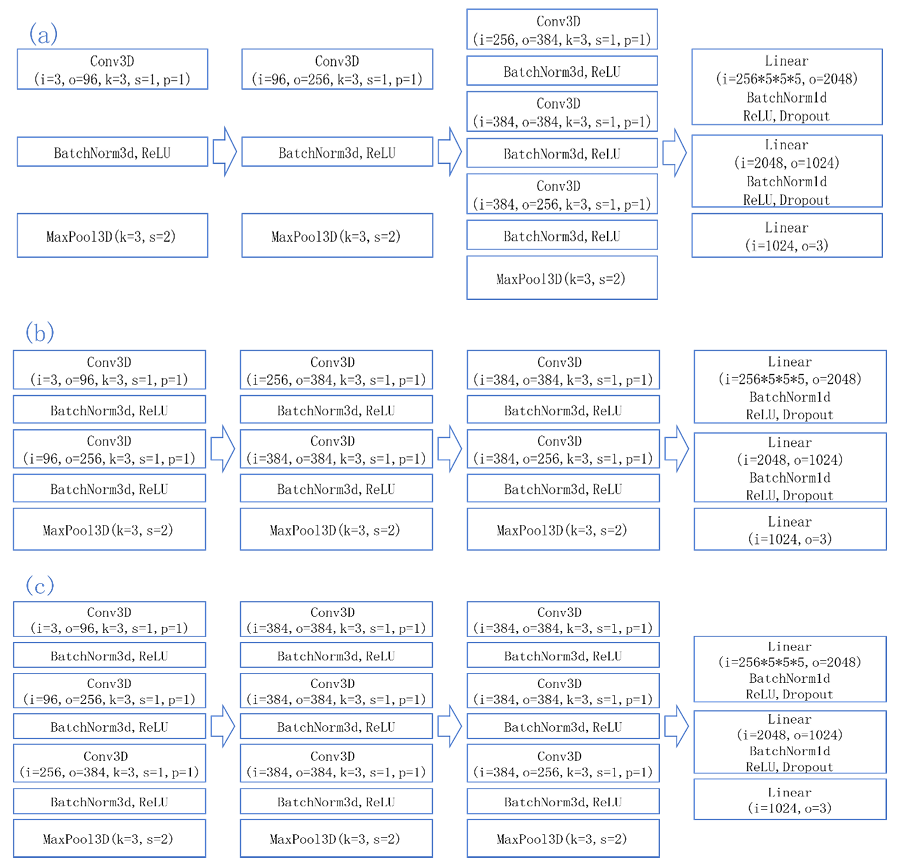
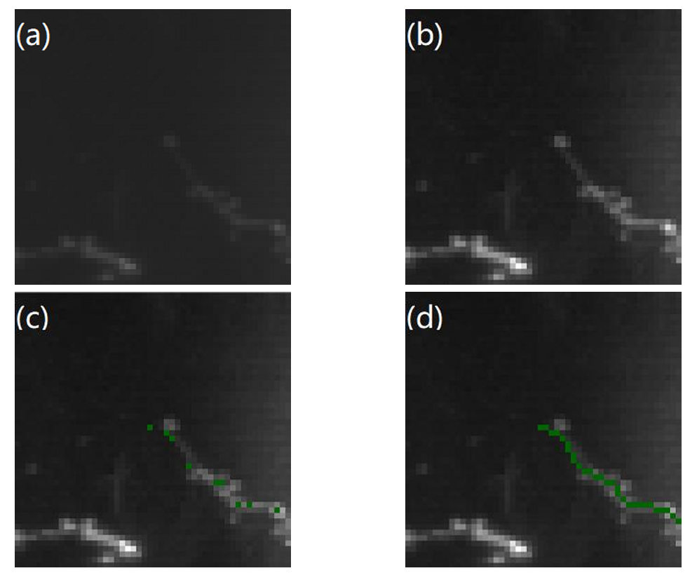

## Data preparation

Save the Z-axis slice to the brain image tiff file.  
Manually tagged swc files. 

## Run procedure

### Generate end-point data

Run generate_image/generate_image.py to get a 50x50x50 image centered on the end-points recorded in the swc file and a projection plot on the xy, xz, yz planes.  
We divide the images into three categories: correctly marked end-point images (positive samples), over-tracked end-point images (negative samples), and untracked end-point images (negative samples). Under normal circumstances, the data of positive samples is much more than that of negative samples, so in order to balance data, The two negative sample images need to be generated by running generate_image/generate_image_over.py and generate_image/generate_image_less.py.

### End-point data classification

In identify_image folder, we provide a method to train image classification tasks by using multiple neural network models. By calling identify_image/jiance.py, the trained model can be invoked for classification test.

### End-point data correction

The above steps can detect overtracked end-point images and untracked end-point images. For the former, we can use change_image/xiujian-new-2.py to carry out swc label pruning to get correctly marked end-point images and swc files, while for the latter, We can use change_image/tianbu.py for swc tag filling to get the correctly tagged end-point image and swc file.
